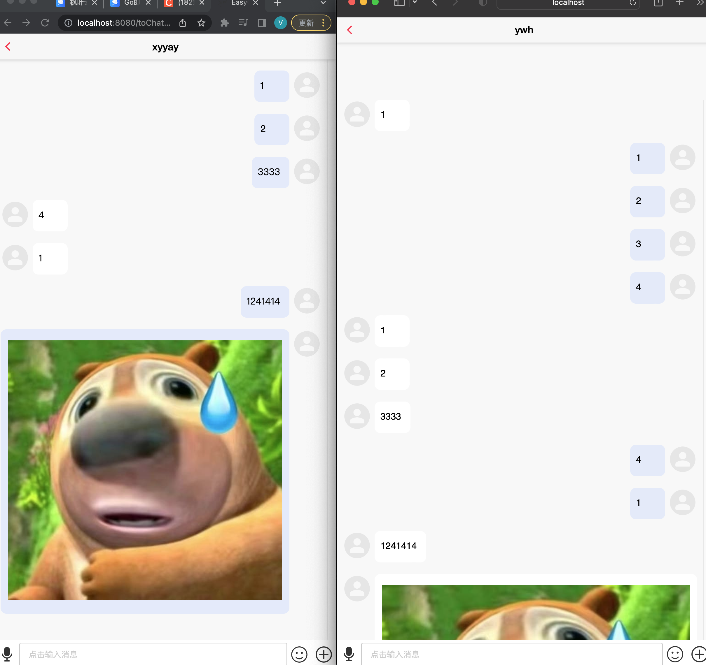
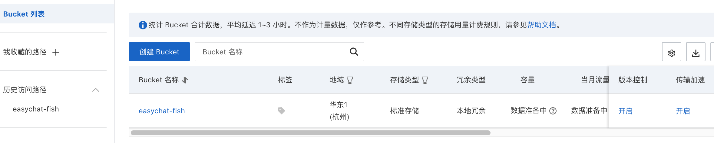
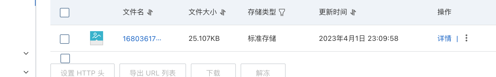
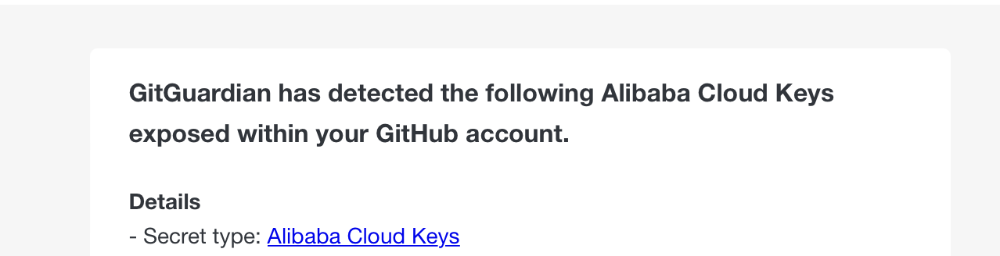
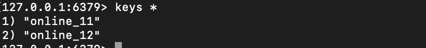
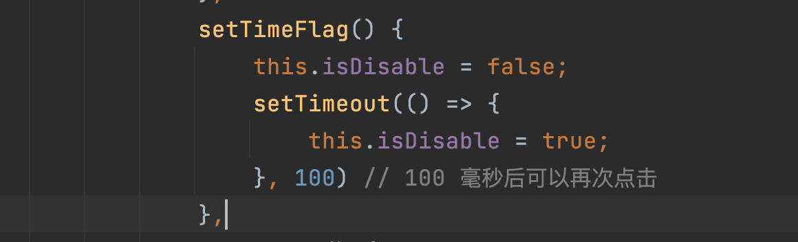
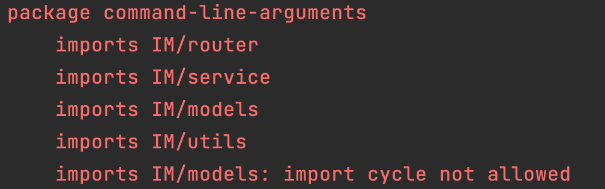

> 感谢室友周昊宇的前端技术支持～ 周神YYDS


#### 技能包++

经过这个项目，又学习到了一些小技能，加油！不断变强！

---

**Viper**

> 参考至：`https://www.liwenzhou.com/posts/Go/viper/`

Viper是适用于Go应用程序的完整配置解决方案。它被设计用于在应用程序中工作，并且可以处理所有类型的配置需求和格式。它支持以下特性：

- 设置默认值
- 从`JSON`、`TOML`、`YAML`、`HCL`、`envfile`和`Java properties`格式的配置文件读取配置信息
- 实时监控和重新读取配置文件（可选）
- 从环境变量中读取

常用操作：

```go
viper.SetConfigName("config") // 配置文件名称
viper.AddConfigPath("/etc/appname/")   // 查找配置文件所在的路径

err := viper.ReadInConfig() // 查找并读取配置文件
if err != nil { // 处理读取配置文件的错误
	panic(fmt.Errorf("Fatal error config file: %s \n", err))
}
```

---

**fatih/color**

> 参考至：`https://blog.51cto.com/mouday/5668520`

通过第三方库，可以轻松在终端打印不同颜色的信息

```go
// 直接使用，输出蓝色文字
color.Blue("hello: %s", "Tom")

// 实例化后使用
colorPrint := color.New()
colorPrint.Add(color.FgRed)   // 红色文字
colorPrint.Add(color.Italic)  // 倾斜
colorPrint.Add(color.BgGreen) // 绿色背景
```

---


gorm.logger 作用?
> 开启慢查询日志?

govalidator 实现修改用户信息时电话和邮箱格式的校验


#### 功能展示

---




#### 性能调优

---

- 阿里云OSS「对象存储服务」存储图片：文件比较多，这样就不会占用本地资源了

  > 阿里云OSS特点：海量、安全、成本低、告诉、可靠，同时提供了丰富的SDK，针对上传文件就有简单上传、分片上传、断点续传上传等
  >
  > 注：也不贵，搞了个半年50G的5块钱
  >
  > 
  >
  > 贴一个学习教程：`https://help.aliyun.com/document_detail/31847.html`
  >
  > 可以很方便的上传一个文件
  >
  > 
  >
  > 不得不说，这刚上传Project到github，就给我发了个被检测到了泄漏了，牛的
  >
  > 

- 心跳检测：用户没有上线，就不推送消息

  > websocket是长连接，不用频繁创建连接，当用户特别多的情况下，会影响性能。当用户不在线，则将其移除推送消息的队列
  >
  > - 页面定时发送一个请求，更新生命时长。在线用户加入Redis，同时设置存活时长

- 在线用户缓存：利用Redis存储在线用户

  > 

- 消息缓存：

  > 通过 Redis 的 Hash/List
  >
  > - Hash： key「message」
  > - List：
  > - Stream：

- 安全性：IP地址变了，就重新登陆


#### 未来改进

---

加入自定义中间件

> 还没想好中间件做什么功能


缓存消息记录


#### Bug记录

---

发送消息对方收不到


群发消息发送消息发不出去


加入群时输入群名报错

> 加入群的时候，通过cominfo 群名/群id进行查找，然后用找到的群的id去查找contact关系，而不应该用输入的cominfo进行查找，因为输入的有可能是群名
>
> ```go
> // 将用户userid加入群comid/群名或者群id => 相当于创建了一个关系contact
> func JoinGroup(userId uint, comId string) (int, string) {
> 	contact := Contact{}
> 	contact.OwnerId = userI
> 	contact.Type = 2
>   
> 	community := Community{}
> 
> 	// 查询群是否存在「通过群名或者群id」
> 	utils.DB.Where("id=? or name=?", comId, comId).Find(&community)
> 	if community.Name == "" {
> 		return -1, "没有找到群"
> 	}
> 	// 拿出群id，应该是用查找到的群id去找contact
> 	groupid := community.ID
> 	utils.DB.Where("owner_id=? and target_id=? and type =2 ", userId, groupid).Find(&contact)
> 
> 	// utils.DB.Where("owner_id=? and target_id=? and type =2 ", userId, comId).Find(&contact)
> 
> 	if !contact.CreatedAt.IsZero() {
> 		return -1, "已加过此群"
> 	} else {
> 		contact.TargetId = community.ID
> 		utils.DB.Create(&contact)
> 		return 0, "加群成功"
> 	}
> }
> ```

---

前端点击了一次，发了两次

> 防止页面请求穿透以及禁止高频发送：设置一个变量，只有变量为true时，可以发送请求，发送完后设置为false,一段时间后变量为true
>
> ```go
> _addfriend: function (dstobj) {
>   //防止一次点击 穿透访问多次
>   if (this.isDisable) { // 如果可以发起请求
>     this.setTimeFlag() // set isDisable
>     var that = this
>     // 发起添加好友请求
>     post("contact/addfriend", { targetName: dstobj, userId: userId() }, function (res) {
>       if (res.Code == 0) {
>         mui.toast("添加成功");
>         that.loadfriends(); // 加载好友列表
>       } else {
>         mui.toast(res.Msg);
>       }
>     })
>   }
> },
> ```
>
> 

---

 前端发送图片后OSS服务器以及保存图片，但是前端显示失败

> Debug后发现是后端返回的url拼接方式有问题
>
> ```go
> 	endpoint := viper.GetString("oss.EndPoint")
> 	endpoint = endpoint[8:]
> 	bucketName := viper.GetString("oss.Bucket")
> 	url := "https://" + bucketName + "." + endpoint + "/" + fileName
> ```


#### 报错记录

---
**Incorrect datetime value: '0000-00-00' for column 'login_time' at row 1**

> 应该是日期字段在mysql 5.7 之后不能为'0000-00-00 00:00:00'，这里采用设置默认值解决
> ```go
> LoginTime     time.Time `gorm:"default:NULL"`
> HeartbeatTime time.Time `gorm:"default:NULL"`
> ```


---
**DENIED Redis is running in protected mode because protected mode is enabled, no bind address was specified, no authentication password is requested to clients.**

> 错误原因：由于redis的保护模式开启了，并且没有绑定ip地址，没有密码认证


---

**error]: dial tcp :6379: connect: connection refused**

解决方法：修改redis.config 中的`bind 127.0.0.1 ::1` 为 `bind 0.0.0.0`
>关闭redis :sudo systemctl stop redis-server 

>重启redis :sudo systemctl restart redis-server 


---

**Mysql：Incorrect string value: '\xE4\xBA\xA4\xE6\xB5\x81...' for column 'name' at row 1**

> 应该是插入的数据有中文，不支持，而导致的，尝试了下全英文插入，可以插入
> 看了下建表时的语句:
>
> ```sql
> CREATE TABLE `community` (
> `id` bigint(20) unsigned NOT NULL AUTO_INCREMENT,
> `created_at` datetime(3) DEFAULT NULL,
> `updated_at` datetime(3) DEFAULT NULL,
> `deleted_at` datetime(3) DEFAULT NULL,
> `name` longtext,
> `owner_id` bigint(20) unsigned DEFAULT NULL,
> `img` longtext,
> `desc` longtext,
> PRIMARY KEY (`id`),
> KEY `idx_community_deleted_at` (`deleted_at`)
> ) ENGINE=InnoDB DEFAULT CHARSET=latin1
> ```
>
> 因为一些一键安装包的环境, `my.ini` 默认配置的字符集是 `latin1` 或者其他, 如果此时一旦不注意, 使用sql语句去创建数据库, 表 默认都是 `latin1`, 因为有些字符集是不能存储中文的,如果需要存储中文, 需要使用GBK,utf8...等字符集
> 解决方案：
>
> 修改字符集：
>
> - 数据库
>
>   ```sql
>   ALTER DATABASE `test_db` CHARACTER SET 'utf8' COLLATE 'utf8_general_ci';
>   ```
>
> - 数据表
>
>   ```sql
>   ALTER TABLE `test_db`.`user` CHARACTER SET = utf8mb4, COLLATE = utf8mb4_bin;
>   ```
>
> - 字段
>
>   ```sql
>   ALTER TABLE `test_db`.`username`  MODIFY COLUMN `password` varchar(30)  CHARACTER SET utf8mb4 COLLATE utf8mb4_bin;
>   ```
>


---

**包引入循环依赖问题**



> golang 不允许循环 import package, 如果检测 import cycle, 会在编译时报错，通常 import cycle 是因为错误或包的规划问题
>
> 解决办法：
>
> 创建一个中间包，然后都引入该包


